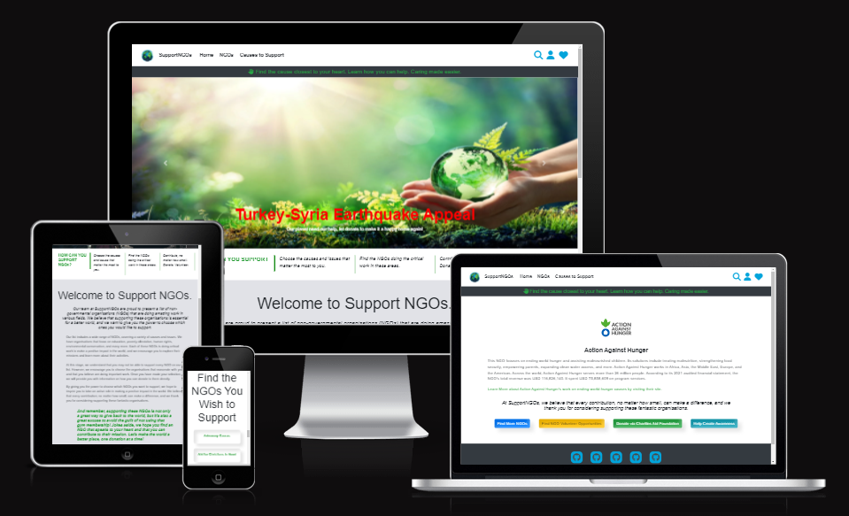
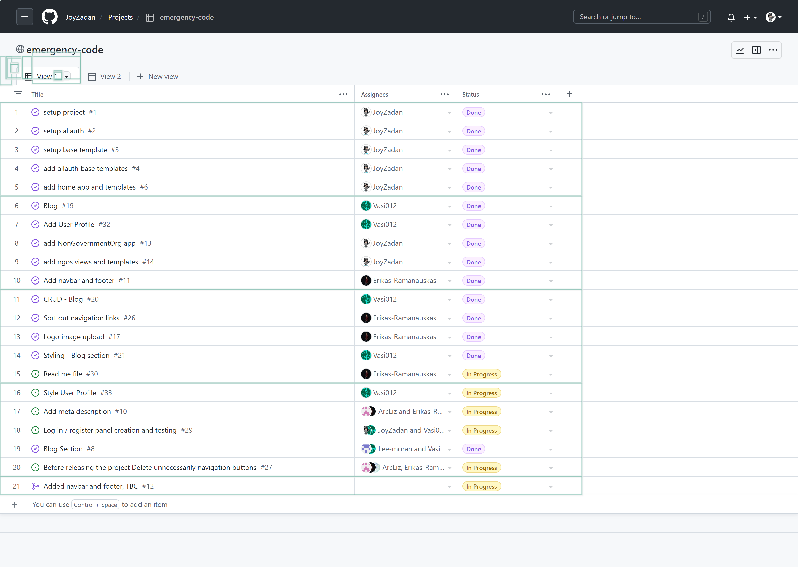

# Emergency Code
 

**[Link to the deployed site](https://support-ngo.herokuapp.com/)**

# Project Overview
Support NGOs is a platform created during a five day World NGO Day hackathon to help connect people with non-governmental organizations that need support, volunteers, and donations. This project was built using Django, Python, JavaScript and Bootstrap 4, deployed on Heroku and uses Amazon S3 for cloud storage.

*At SupportNGOs, we believe that every contribution, no matter how small, can make a difference. We give you the power to choose your causes and the NGOs you'd like to support.* - [Vasi Pavaloi, Team Emergency Code](https://code-institute-room.slack.com/archives/D04QGJ3ANQH/p1676809115001019)

---
**Table of Contents**
* [Project Overview](#project-overview)
* [User Experience](#user-experience)
    * [Strategy Plane](#strategy-plane)
    * [Scope Plane](#scope-plane)
    * [Structure Plane](#structure-plane)
    * [Skeleton Plane](#skeleton-plane)
    * [Surface Plane](#surface-plane)
* [Agile Methodolody](#agile-methodology)
* [Features](#features)
* [Technologies Used](#technologies-used)
* [Testing](#testing)
* [Deployment](#deployment)
* [Credits](#credits)
* [Acknoledgements](#acknowledgements)

---
## Project Overview
Hand of Empathy is a multi-brand, ecommerce full stack project built using Django, Python, JavaScript and Bootstrap 4. The site is deployed to Heroku, 
Hand of Empathy is a RealEstate site that links the consumer to the major NGO catergories. Where a user can select the prefered category donate to that prefered charity. 

## User Experience

### Strategy Plane

### Scope Plane

### Structure Plane

### Skeleton Plane

### Fonts and color

Exo, Roboto, and Montserrat are popular font choices for a variety of design projects due to their versatility and readability. 
Exo is a modern sans-serif font that has a clean and futuristic look, making it suitable for technology-based designs. 
Roboto, on the other hand, is a more traditional sans-serif font with a humanist touch, giving it a more friendly and approachable feel, making it suitable for both digital and print materials. 
Montserrat is a geometric sans-serif font that has a distinctive style with a vintage touch, making it suitable for designs that require a retro or nostalgic feel. 

Additionally, all three fonts have a range of weights and styles that allow for flexibility in design, making them suitable for a variety of projects. Whether it's for a website, logo, or printed material, Exo, Roboto, and Montserrat are excellent choices for designers looking for fonts that are modern, versatile, and highly readable.

An earth color scheme is an excellent choice for NGOs, as it communicates the organization's connection to nature and the environment. Using colors such as brown, green, and blue creates a warm and inviting palette that reflects the organization's values and mission.

White, grey, and green are commonly used colors for non-governmental organizations (NGOs) due to their associations with certain values and qualities. White is a symbol of purity, cleanliness, and transparency, which are important values for NGOs that strive for accountability and honesty. NGOs often need to build trust with their stakeholders, including donors and beneficiaries, and white can help convey a sense of openness and sincerity.

Grey is a neutral color that can represent balance, maturity, and reliability. For NGOs that deal with complex social issues, grey can help communicate the seriousness and thoughtfulness of their work. Grey can also convey a sense of stability and longevity, which can be reassuring to stakeholders who want to see long-term solutions to social problems.

Green is a color that is often associated with nature, health, and sustainability. For NGOs that work in environmental conservation, public health, or sustainable development, green can be a powerful symbol of their mission. Green can also represent growth, renewal, and hope, which can be inspiring to stakeholders who want to see positive change in the world.

### Surface Plane

---
## Agile Methodology
### **GitHub Projects**

GitHub Projects was used to manage the development of the site. It helped us break down the larger issues into smaller issues and how these fit into the overall goals of implementing specific features we wanted for the site. We also used labels to distinguish the issues which are part of the setup, of the documentation, the must haves and the enhancements.

* GitHub Projects - in progress

---
## Features

---
## Technologies Used
### **Languages Used**
* [HTML5](https://en.wikipedia.org/wiki/HTML5) was used for the content and structure of the site.
* [CSS3](https://en.wikipedia.org/wiki/CSS#CSS_3) was used for the styling of the site.
* [JavaScript](https://en.wikipedia.org/wiki/JavaScript) was used for the interactivity of the site.
* [Python](https://www.python.org/) was used for the back end programming of the site.
## Frameworks Used
* [DJANGO - v3.2 ](https://docs.djangoproject.com/en/4.1/releases/3.2/) Django is a free and open-source, Python-based web  framework that follows the model–template–views architectural pattern.
* [Bootstrap4 - v4.6](https://getbootstrap.com/docs/4.6/getting-started/introduction/) was used as the frontend framework.
## Databases Used
* [DB.SQLITE3](https://docs.djangoproject.com/en/4.1/ref/databases/#sqlite-notes) was the database used for the project (development).
* [ElephantSQL](https://www.elephantsql.com/) ElephantSQL's Postgres as a Service was used to host the the database for the project (production).
## **Libraries and Packages Used**
* [django-allauth](https://django-allauth.readthedocs.io/en/latest/) is an integrated set of Django applications dealing with account authentication, registration, management, and third-party (social) account authentication.
* [JQuery - v3.5.1](https://jquery.com/) is a fast, small, and feature-rich JavaScript library.
* [Font Awesome Kit](https://fontawesome.com/v5/docs/web/setup/use-kit) is used for its icon toolkit.
* [django-ckeditor v6.5.1](https://django-ckeditor.readthedocs.io/en/latest/) was used to provide a RichTextField p, RichTextUploadingField, CKEditorWidget and CKEditorUploadingWidget
* [django-js-asset v2.0.0](https://pypi.org/project/django-js-asset) This package provides a way of inserting script tags into Django templates that provide extra attributes such as `id` and `data-*` for CSP-compatible data injection.
* [django-summernote==0.8.20.0](https://pypi.org/project/django-summernote/) Summernote is a simple WYSIWYG editor. django-summernote allows you to embed Summernote into Django very handy. Support admin mixins and widgets.
* [django-crispy-forms, v1.14.0](https://pypi.org/project/django-crispy-forms/) was used to build programmatic reusable layouts out of form components.
* [gunicorn](https://gunicorn.org/) - a Python WSGI HTTP Server that allows us to run any Python application concurrently by running multiple processes within a single dyno
* [pillow](https://pypi.org/project/Pillow/) - a required Python imaging library used to enable handling of images.
* [psycopg2](https://pypi.org/project/psycopg2/) - a postgresql database adapter for python and used to connect with our postgres database
* [boto3==1.26.74](https://pypi.org/project/boto3/), [botocore==1.29.74] is an Amazon Web Services (AWS) software development kit (SDK) used to connect to the S3 bucket
* [pip](https://pip.pypa.io/en/stable/) is the package installer for Python, allowing us to install the packages we need for this site.
* [django storages](https://django-storages.readthedocs.io/en/latest/) - collection of custom storage backends for Django

## **Programmes and Applications Used**
* [Lucid Chart](https://www.lucidchart.com/pages/) was used to draw and build the Entity Relationship Diagram. It was also used to draw the User Flow Diagram.
* [favicon.io](https://favicon.io/) used to create the site's favicon
* [Git](https://git-scm.com/) used for version control and saving work in the repository, using the GitPod extension in Google Chrome to commit to GitHub.
* [GitHub](https://github.com/) is the project's git repository
* [GitHub Projects](https://docs.github.com/en/issues/planning-and-tracking-with-projects/learning-about-projects/about-projects) used to track and integrate issues for Agile Development
* [Chrome DevTools](https://www.google.com/intl/en_uk/chrome/) - used for debugging, validation (Lighthouse) and taking fullscreen screenshots of the site
* [CloudConvert](https://cloudconvert.com/webp-converter) and [OnlineConvert](https://www.online-convert.com/) were used to convert the png images of products, brands and site background images to next generation image format, webp.
* [Photoshop](https://www.adobe.com/uk/products/photoshop.html) used to resize the images used on the site

## **Cloud Application Platforms Used**
* [Heroku](https://devcenter.heroku.com/) was used for hosting and deployment of the live site. Throughout, we have ensured the version being deployed to Heroku matches the development version by checking features and screen layouts on both versions.

## **Cloud Storage Services Used**
* [AWS S3](https://aws.amazon.com/) was used to store the images and static files.

---

## Testing

---
## Deployment

The master branch (main) of this repository has been used for the deployed version of this application.

## Using Github & Gitpod

To deploy our project, we had to use the [Code Institute Full Template](tbc).

- Click the Use This Template button.

- Add a repository name and brief description.

- Click the Create Repository from Template to create your repository.

- To create a Gitpod workspace you then need to click Gitpod, this can take a few minutes.

When you want to work on the project it is best to open the workspace from Gitpod (rather than Github) as this will open your previous workspace rather than creating a new one. You should pin the workspace so that it isn't deleted.

Committing your work should be done often and should have clear/explanatory messages, use the following commands to make your commits:
- git add . :  adds all modified files to a staging area
- git commit -m "A message explaining your commit": commits all changes to a local repository.
- git push: pushes all your committed changes to your Github repository.

## Forking the GitHub Repository

By forking the GitHub Repository you will be able to make a copy of the original repository on your own GitHub account allowing you to view and/or make changes without affecting the original repository by using the following steps:

1. Log in to GitHub and locate the GitHub Repository
2. At the top of the Repository (not top of page) just above the "Settings" button on the menu, locate the "Fork" button.
3. You should now have a copy of the original repository in your GitHub account.

## Making a Local Clone

1. Log in to GitHub and locate the GitHub Repository
2. Under the repository name, click "Clone or download".
3. To clone the repository using HTTPS, under "Clone with HTTPS", copy the link.
4. Open command line interface on your computer
5. Change the current working directory to the location where you want the cloned directory to be made.
6. Type git clone, and then paste the URL you copied in Step 3.
    - $ git clone ADD Project link
7. Press Enter. Your local clone will be created.

## Deployment To Heroku

- The App live link is: TBC!
- The project was deployed to Heroku using the following steps.
- Log in to Heroku and create an App.
- At the Deploy tab, select GitHub as the deployment method.
- Select the repository name and click Search. Once it is found, click Connect.
- Select the branch you want to deploy, then click Deploy Branch.

The deployment process should happen smoothly in case all deployment files are fully functional. Click now the button Open App on the top of the page to access your App.

---
## Credits

---

## Acknowledgements